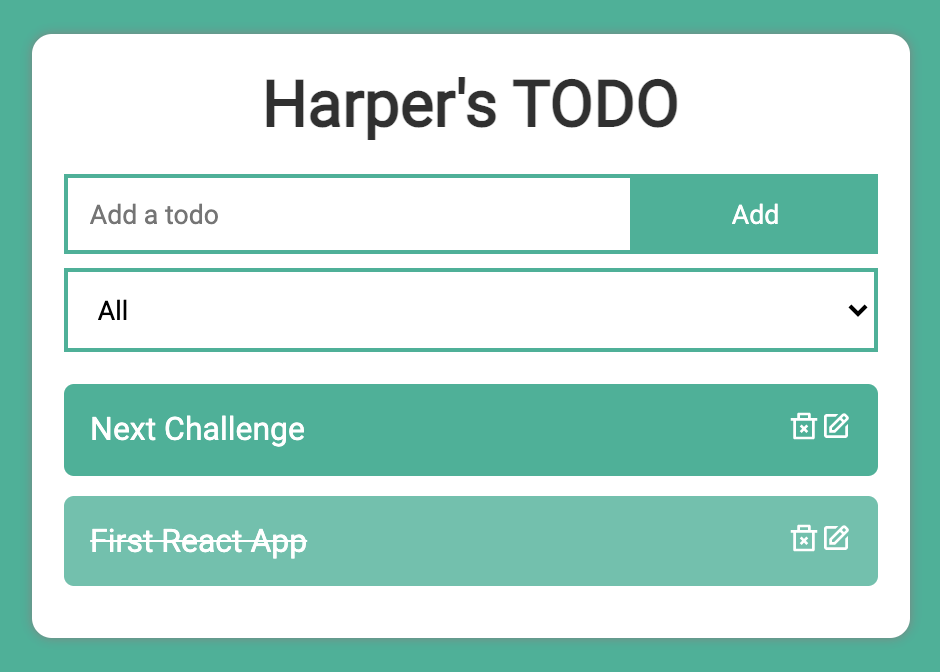
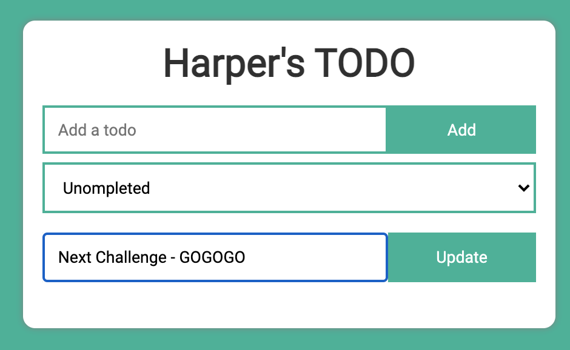
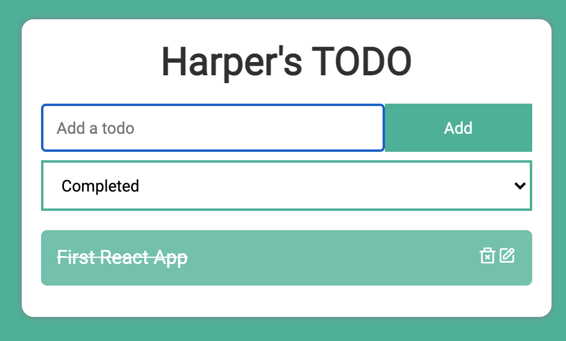
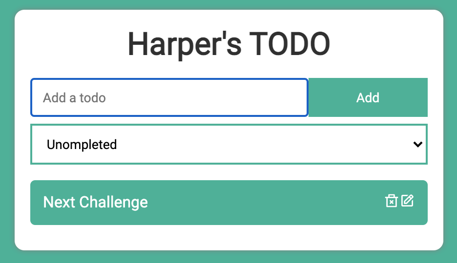

# Todo App 

This a Todo app using React

### Run the app

Under project directory, run ```npm start``` to run the app in the development mode.\
Open [http://localhost:3000](http://localhost:3000) to view it in the browser.

### Screenshots
#### All

#### Edit

#### Completed

#### Uncompleted

